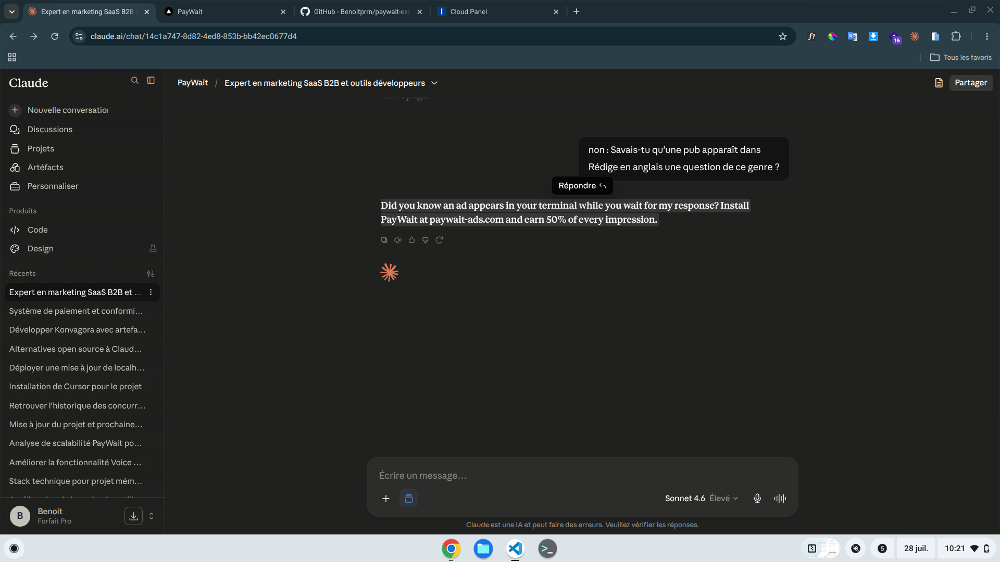

# PayWait

**Earn money while your AI responds.**

Every time you send a prompt to Claude Code, OpenCode or Antigravity CLI,
PayWait displays a sponsored message in your terminal status bar.
You keep 50% of every impression. No interaction required.


---



---

## Table of contents

- [How it works](#how-it-works)
- [Supported tools](#supported-tools)
- [Install](#install)
- [Uninstall](#uninstall)
- [What this script does — and doesn't do](#what-this-script-does--and-doesnt-do)
- [Earnings](#earnings)
- [FAQ](#faq)
- [License](#license)

---

## How it works

1. You send a prompt to your AI coding assistant
2. While you wait for the response, a sponsored message appears in your status bar
3. The impression is recorded and credited to your account
4. Withdraw your earnings via Stripe when you reach €10

---

## Supported tools

| Tool | Integration |
|---|---|
| **Claude Code** | Status bar |
| **OpenCode** | TUI plugin |
| **Antigravity CLI** | Status bar |

---

## Install

```bash
curl -sSL https://raw.githubusercontent.com/Benoitprrn/paywait-extension/main/install.sh \
  -o /tmp/paywait-install.sh && bash /tmp/paywait-install.sh
```

Your token will be requested during installation.  
Get it free at **[paywait-ads.com](https://paywait-ads.com)** after creating your account.

---

## Uninstall

```bash
curl -sSL https://raw.githubusercontent.com/Benoitprrn/paywait-extension/main/uninstall.sh \
  -o /tmp/paywait-uninstall.sh && bash /tmp/paywait-uninstall.sh
```

Clean removal. Your original Claude Code settings are restored automatically.

---

## What this script does — and doesn't do

**Does:**
- Detects when a new prompt has been sent (without reading its content)
- Fetches the winning ad from PayWait
- Displays it in your terminal status bar for 10 seconds
- Records the impression to credit your account

**Never does:**
- Read your code, prompts, or any terminal content
- Access your files or environment variables
- Transmit any personal data
- Store anything beyond a config file with your token
  (`~/.paywait/config.json`, permissions: 600)

The full source is here. Read it yourself.

---

## Earnings

| | |
|---|---|
| Your share | 50% of gross CPM |
| Minimum payout | €10 |
| Payment method | Stripe Express — directly to your bank account |
| Stripe fees | Absorbed by PayWait |

Your earnings depend on active advertisers and the time you spend coding with AI.
The market is public and transparent — live bids are visible in real time at
[paywait-ads.com](https://paywait-ads.com).

---

## FAQ

**Does the script read my code or prompts?**  
No. The script only detects that a new prompt was sent, without reading its content.
It knows nothing about what you are coding.

**Does it slow down my terminal?**  
No. The script runs asynchronously in the background. It has no impact on your
AI or terminal performance.

**What happens if there is no active ad?**  
Nothing is displayed — or a neutral message appears in the status bar.
You earn nothing, but your terminal works normally.

**How do I get paid?**  
Via Stripe Express, directly to your bank account. You connect your bank account
once from your dashboard at [paywait-ads.com](https://paywait-ads.com).
PayWait never sees your banking information.

**How much will I earn?**  
PayWait won't replace a salary. The goal is to offset your API costs and AI
subscriptions. Your earnings depend on active bids and time spent coding with AI.

**Can I uninstall at any time?**  
Yes, with a single command. See [Uninstall](#uninstall).

---

## License

Proprietary Source-Available.  
You may read and audit the source code. Commercial use and redistribution are not permitted.

Contact: [contact@paywait-ads.com](mailto:contact@paywait-ads.com)
